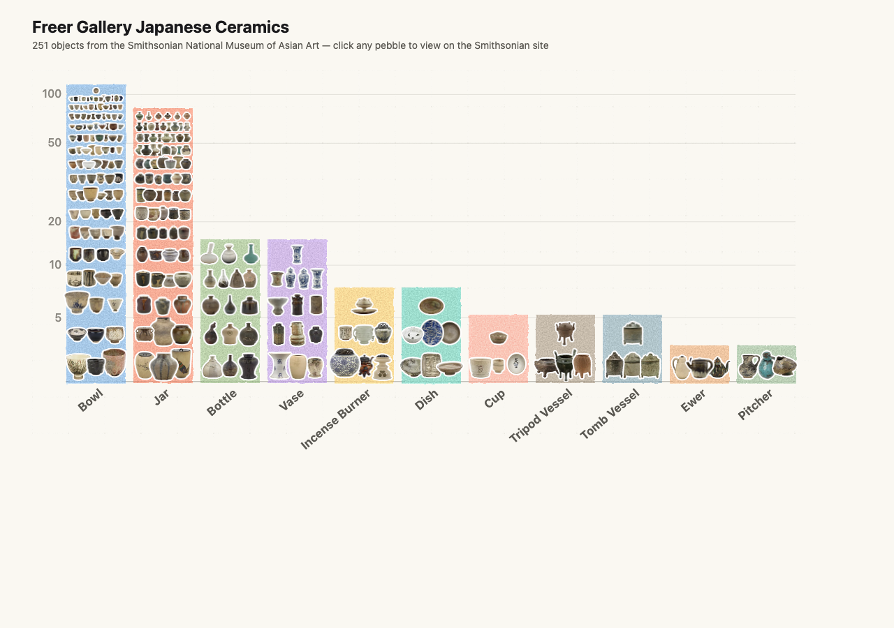
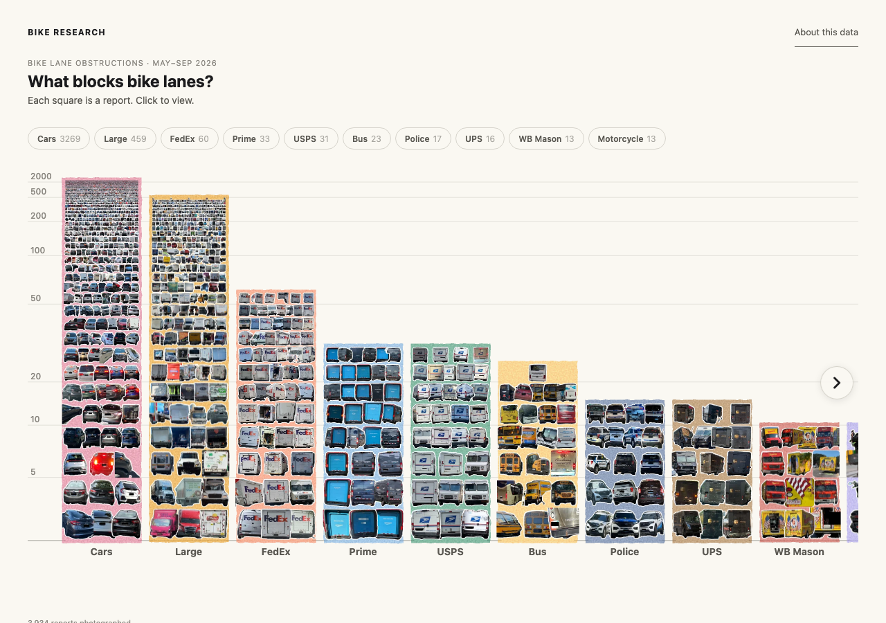

# Pebble Bar Chart

The **pebble bar chart** is a logarithmic-density stacked bar chart where every
data point is individually visible.  Items stack from large squares at the bottom
to tiny ones at the top, creating a natural visual hierarchy that shows both
exact counts and relative magnitudes — like a histogram where every data point
gets its own pixel.

Each bar gets a **watercolor wash** by default — a turbulence texture that
gives the chart a hand-painted, organic look.  Items with images sit on top of
the wash; items without images are represented by the wash alone.

Every bar is drawn in Python (numpy and Pillow) to a single image: the layout,
pictures, white outlines, rounded corners and watercolor all go into it.  The
same images feed three outputs:

| Function | Output | Use it for |
|----------|--------|------------|
| `pebble_bar_chart` | Interactive HTML page | Reports where items show tooltips and link to detail pages |
| `pebble_bar_figure` | matplotlib figure | Static PNG/PDF charts and notebooks |
| `write_pebble_assets` | One image per bar + `manifest.json` | Websites that place the chart in their own page with `pebble-view.js` |

The browser never draws pebbles.  The HTML page loads one image per bar and a
small script (`pebble-view.js`) that maps the pointer to the item under it, so
a chart with thousands of items loads as fast as one with ten.

## Quick start

```python
from matviz import pebble_bar_chart

categories = [
    {"name": "trucks", "label": "Trucks", "color": "#b87200",
     "items": [{"id": str(i)} for i in range(87)]},
    {"name": "vans", "label": "Vans", "color": "#186b4e",
     "items": [{"id": str(i)} for i in range(54)]},
    {"name": "sedans", "label": "Sedans", "color": "#4e82b8",
     "items": [{"id": str(i)} for i in range(18)]},
]

pebble_bar_chart(
    categories,
    "fleet.html",
    title="Vehicle Fleet",
    subtitle="Each square = one vehicle",
    bar_width=150,
    log_base=1.1,
    item_offset=16,
    h_squeeze=0.7,
    bar_gap=21,
)
```

Open `fleet.html` in a browser to see the chart.  The page is a single file:
the bar images are embedded in it.

The same chart as a static matplotlib figure:

```python
from matviz import pebble_bar_figure

fig = pebble_bar_figure(categories, bar_width=150, log_base=1.1,
                        item_offset=16, h_squeeze=0.7, bar_gap=21)
fig.savefig("fleet.png", dpi=144, bbox_inches="tight")
```

## How it works

Each bar is a vertical stack of rows.  Row *r* (counting from 0 at the bottom)
has `floor(base^r)` columns.  Each cell is `barWidth / base^r` pixels wide and
tall (square).  The logarithmic stacking means:

- **Bottom rows**: 1–2 large squares per row (prominent, individually visible)
- **Top rows**: many tiny squares packed together (conveys volume)

The `log_base` parameter controls how fast columns multiply:

| `log_base` | Behavior |
|------------|----------|
| √2 ≈ 1.414 (default) | Columns double every 2 rows — balanced |
| 1.1 | Slow growth — tall, narrow pyramids |
| 2.0 | Fast growth — short, wide pyramids |

## Item data

Each item in a category can carry:

| Key | Type | Description |
|-----|------|-------------|
| `id` | str | Unique identifier |
| `label` | str | Tooltip text on hover |
| `link` | str | URL opened on click |
| `src` | str | Local image file drawn in the cell (relative to `image_dir`) |
| `image` | PIL.Image | An already-loaded image, instead of `src` |

```python
items = [
    {"id": "v001", "label": "Truck #1", "link": "https://example.com/v001",
     "src": "images/v001.png"},
    {"id": "v002", "label": "Truck #2"},  # represented by the watercolor wash
]
pebble_bar_chart(categories, "fleet.html", image_dir="data/")
```

Pictures are stretched to fill their square, given a white outline that
follows the image's alpha mask (`outline_radius`, default 1px) and rounded
corners.  Transparent cutouts (PNG with alpha) look best.  Items without
images are represented by the wash alone.  Images must be local files: download
remote images first, or pass `image_loader=` a function that returns a PIL image
for an item.  A missing file stops the build with the item's id.

## Watercolor styling

Watercolor is **on by default** — the `color` you set on each category is used
for the wash.  You only need `watercolor_color` if you want the wash to be a
different shade from the base color:

```python
categories = [
    # Watercolor uses the color automatically
    {"name": "alpha", "label": "Alpha", "color": "#b87200",
     "items": [...]},

    # Override: base color is gray, but wash is amber
    {"name": "beta", "label": "Beta", "color": "#888",
     "watercolor_color": "#b87200",
     "items": [...]},

    # Opt out of watercolor entirely — flat solid squares
    {"name": "gamma", "label": "Gamma", "color": "#4e82b8",
     "watercolor_color": "",
     "items": [...]},
]
```

## Key parameters

| Parameter | Default | Description |
|-----------|---------|-------------|
| `bar_width` | 120 | Pixel width of each bar before squeeze |
| `log_base` | √2 | Log base controlling density growth |
| `item_offset` | 0 | Invisible padding items to skip sparse bottom rows |
| `h_squeeze` | 1.0 | Horizontal squeeze factor (0–1) |
| `bar_gap` | 8 | Pixels between adjacent bars |
| `outline_radius` | 1 | White outline around image items (0 to disable) |
| `sort_desc` | True | Sort categories largest first |
| `show_count` | True | Show item count next to labels |
| `scale` | 2 | Image pixels per CSS pixel.  2 is sharp on most high-density screens; 3 is a little sharper on some phones at about twice the file size |
| `supersample` | 4 | Drawing resolution multiplier before shrinking to `scale`.  Keeps the sub-pixel pebbles at the top of big bars visible as dots |
| `seed` | 0 | Fixes which pebble overlaps which and the watercolor texture.  The same seed always gives identical images |
| `embed_images` | True | (`pebble_bar_chart`) Embed the bar images in the HTML.  `False` writes them to `<name>_files/` beside the page |
| `image_dir` | None | Base folder for relative `src` paths |
| `open_browser` | False | Open the file in the default browser |

## Using the chart on your own website

`write_pebble_assets` writes one image per bar and a `manifest.json`.  Copy
`matviz/_assets/pebble-view.js` into the site and draw the chart with it:

```python
from matviz import write_pebble_assets

write_pebble_assets(categories, "site/static/chart/", bar_width=150,
                    log_base=1.1, item_offset=16, h_squeeze=0.7, bar_gap=21)
```

```html
<div id="chart"></div>
<script src="pebble-view.js"></script>
<script>
  fetch("/static/chart/manifest.json").then(r => r.json()).then(data => {
    const chart = renderPebbleView(document.getElementById("chart"), data,
                                   { baseUrl: "/static/chart/" });
    // chart.yAxis can be moved outside a horizontal scroll container
    // to keep the axis pinned; chart.bars are the bar elements.
  });
</script>
```

The images are built once, offline.  Rebuild them only when the data or chart
options change.

## Real-world examples

### Freer Gallery Japanese Ceramics

[](https://jonathan.lansey.net/pottery/)

251 objects from the Smithsonian — each pebble is a clickable thumbnail.
[View the live chart →](https://jonathan.lansey.net/pottery/)

### What Blocks Bike Lanes?

[](https://bikeresearch.net/articles/en/what-blocks-bike-lanes/)

Urban infrastructure data visualized as a pebble bar chart.
[View the article →](https://bikeresearch.net/articles/en/what-blocks-bike-lanes/)

## Full example

See `examples/pebble_bar_example.py` in the repository for a complete working
example with multiple categories.

## API reference

```{eval-rst}
.. autofunction:: matviz.pebble_bar.pebble_bar_chart
.. autofunction:: matviz.pebble_bar.pebble_bar_figure
.. autofunction:: matviz.pebble_bar.write_pebble_assets
.. autofunction:: matviz.pebble_bar.render_pebble_chart
.. autofunction:: matviz.pebble_render.render_bar
.. autofunction:: matviz.pebble_layout.bar_rows
```
