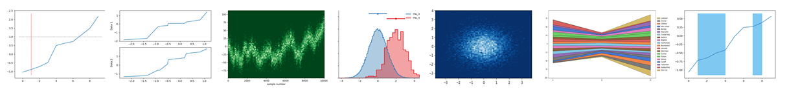

.. matviz documentation master file, created by
   sphinx-quickstart on Tue Jul 28 14:11:03 2020.
   You can adapt this file completely to your liking, but it should at least
   contain the root `toctree` directive.

Welcome to Matviz's documentation!
==================================
MatViz is an usefull libraries to help data scientists with data visualization. 

Matviz include:

* **histogram_utils** includes awesome functions for making nice 1D and 2D histograms.

* **viz** includes small helpful scripts to change figure sizes and a few longer scripts like `streamgraph` .

.. toctree::
   :maxdepth: 2
   :caption: Contents:

   
   histogram_utils
   viz

You can download MatViz on `GitHub <http://github.com/JLansey/matviz>`_

Indices and tables
--------------------------------

* :ref:`genindex`
* :ref:`modindex`
* :ref:`search`
